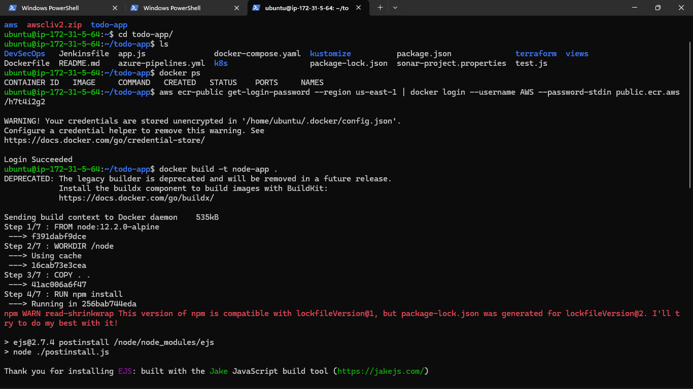
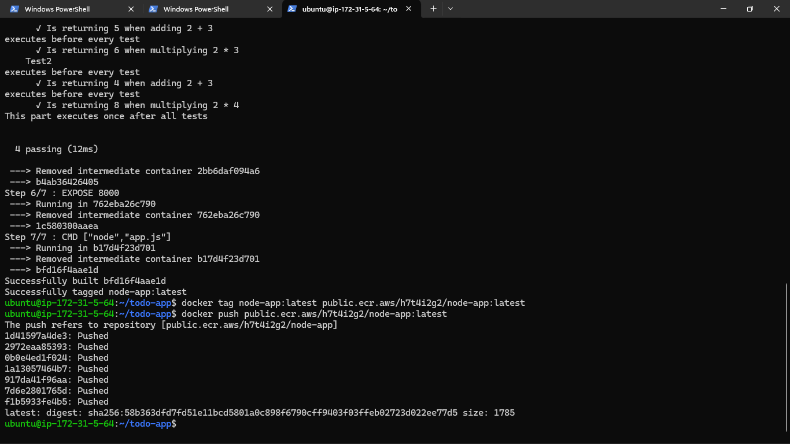
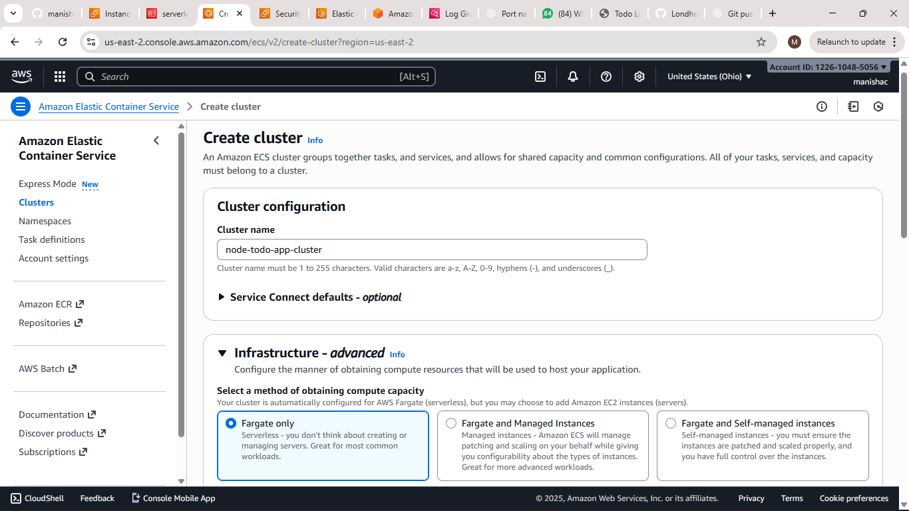
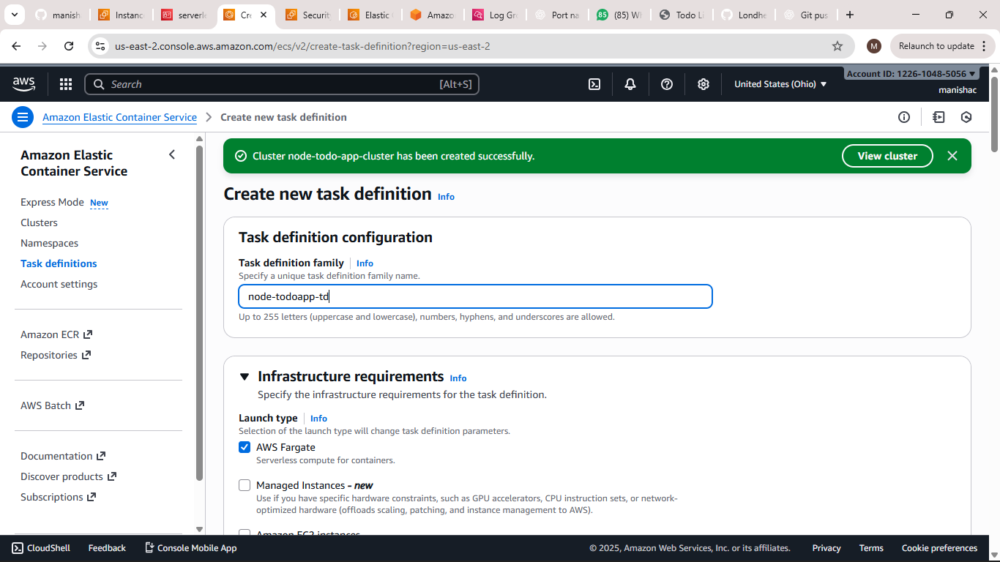
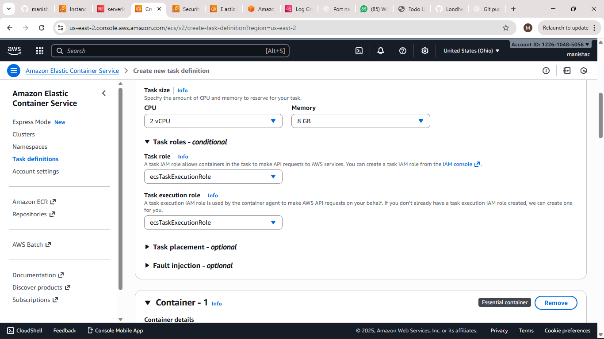
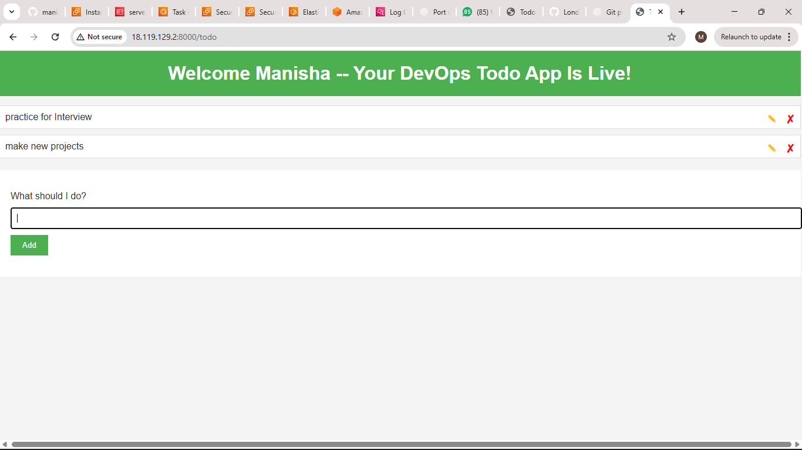

# Todo‑App

A simple **Node.js Todo application** containerized with **Docker** and deployed on **AWS ECS/ECR**.  

It demonstrates how to build a Docker image, push it to AWS ECR, and run it as a containerized task on ECS.  

The app provides basic **CRUD operations** for managing todos, making it a practical demo for cloud deployment workflows. 

Ideal for learning **Docker, AWS ECS, and container orchestration** basics in a hands-on project.

**This project demonstrates how to:**

- Containerize a Node.js application using **Docker**
  
- Push Docker images to **AWS Elastic Container Registry (ECR)**
  
- Deploy and run the application on **AWS ECS** with **Fargate** or **EC2 launch type**
  
- Manage containers and tasks efficiently in the cloud
  

The app itself is simple, featuring basic **CRUD (Create, Read, Update, Delete)** operations for todos, but the main goal is to showcase **end-to-end container deployment workflow** on AWS.  

**Why this project?**  

- Perfect for beginners to learn **Docker + AWS ECS basics**
  
- Provides hands-on experience with **cloud deployment and container orchestration**  

## 🛠 Prerequisites

- Docker installed
  
- AWS account & AWS CLI configured (with permissions for ECR & ECS)
   
- (Optional) Node.js installed — only needed if you want to run without Docker
  

## 🚀 Deployment / Setup Steps

### 1. Clone the repository  

**** 
     git clone https://github.com/your‑username/todo-app.git
     cd todo-app
****

### 2. Build the Docker Image

****
    docker build -t todo-app .
****
| Caption| Screenshot|
|------------|---------|
| Docker image build in progress|  |

### 3. Push Docker Image to AWS ECR

•  Create a repository in AWS ECR.

• Authenticate Docker with ECR:
   
****
    aws ecr get-login-password --region <your-region> | docker login --username AWS --password-stdin <your-account-id>.dkr.ecr.<region>.amazonaws.com
****

• Tag and push image:
   
****
    docker tag todo-app:latest <your-ecr-repo-uri>:latest

    docker push <your-ecr-repo-uri>:latest
****

| Caption| Screenshot|
|------------|---------|
| Successfully pushed Docker image to AWS ECR.|  |

### 4. Create ECS Cluster

• Go to AWS ECS → Clusters → Create Cluster.

• Choose EC2 Linux + Networking or Fargate.

• Configure cluster name and networking.

| Caption| Screenshot|
|------------|---------|
| ECS cluster creation screen |  |

### 5. Create Task Definition

• Go to Task Definitions → Create Task Definition.

• Choose Fargate.

• Configure task name, container name, and container image (from ECR).

• Allocate memory and CPU.

| Caption| Screenshot|
|------------|---------|
| ECS Task Definition configuration |  |

### 6. Set Container Settings

• Add port mappings (e.g., 8000).

• Set environment variables if required.

| Caption| Screenshot|
|------------|---------|
| Configuring container port mappings and environment variables |  |

### 7. Run Task in Cluster

• Go to Clusters → Your Cluster → Tasks → Run Task.

• Select the task definition and launch type.

• Monitor the running task.

| Caption| Screenshot|
|------------|---------|
| ECS task running successfully |  |

### 8. Access Application

• Copy the public IP of the ECS task.

• Open in browser:  **** http://<public-ip>:8000 ****

| Caption| Screenshot|
|------------|---------|
| Todo app running successfully on ECS |  |

